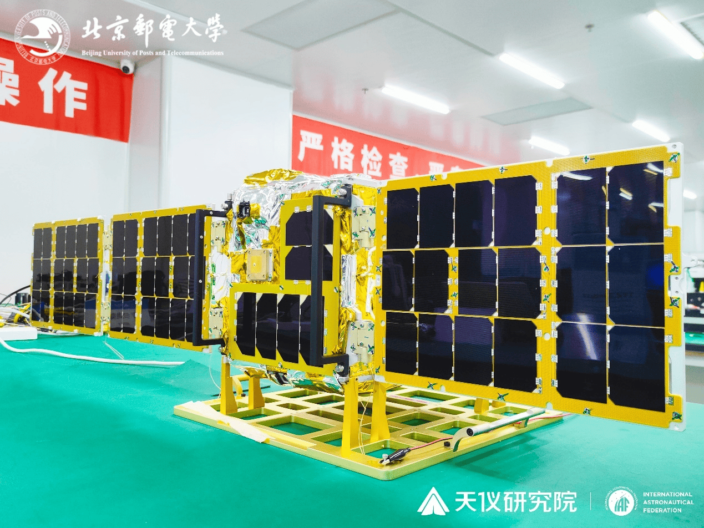
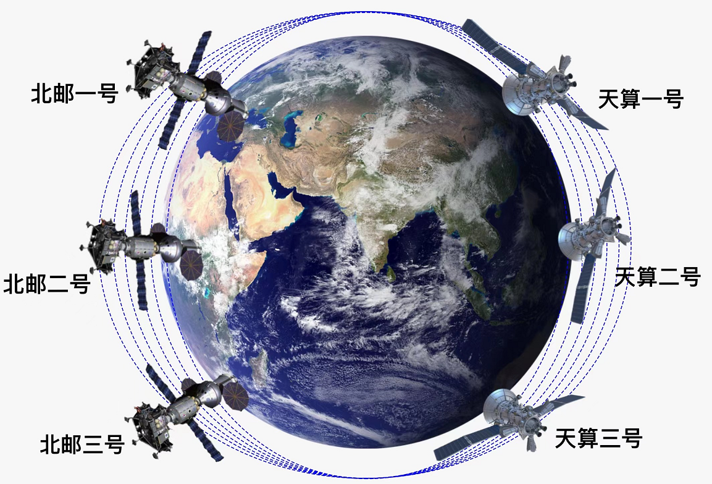

Shangguang Wang is a professor at the School of Computer Science, Beijing University of Posts and Telecommunications, China. He is the founder&chief scientist of [Tiansuan Constellation](). He is also Executive Dean at School of Computer Science, Deputy Dean at Shenzhen Research Institute, Deputy Director at SKL of Networking and Switching Technology, and Director at Star Network and Intelligence Computing Laboratory.

His research interests include service computing, mobile edge computing, cloud computing, and satellite computing. He is currently serving as chair of IEEE Technical Community on Services Computing([TCSVC](http://tab.computer.org/tcsvc/)). He also served as general chairs or program chairs of 10+ IEEE conferences, advisor/associate editors of several journals such as IEEE Transactions on Services Computing, Journal of Cloud Computing, Journal of Software: Practice and Experience, International Journal of Web and Grid Services, and so on. He is a senior member of the IEEE, and Fellow of the IET.

NEW
======

**July 10, 2024**: Our paper “An Empirical Study of Rust-for-Linux: The Success, Dissatisfaction, and Compromise”，**USENIX ATC 2024 Best Paper Award!**

**December 9, 2023**：At 7:39 AM on December 9th, the Zhuque-2 YAO-3 launch vehicle was successfully launched from the Jiuquan Satellite Launch Center in China. It successfully placed the Tianyi-33 Satellite into its designated orbits. The Tianyi-33 satellite is a 50kg class space science experimental satellite equipped with an operating system independently developed by Beijing University of Posts and Telecommunications—**the Rust-based dual-kernel real-time operating system RROS** (<https://github.com/BUPT-OS/RROS>). RROS will carry out general tasks represented by tensorflow/k8s and real-time tasks represented by real-time file systems and real-time network transmission on the satellite. It will ensure the normal execution of upper-layer applications and scientific research tasks, such as time-delay measurement between satellite and ground, live video broadcasting, onboard web chat services, pseudo-SSH experiments, etc. This marks the official application of a Rust-written dual-kernel operating system in a satellite scenario.

**January 15, 2023**：The third satellite called **BUPT-1** of Tiansuan constellation was successfully launched from Taiyuan, China, at 11:14am on January 15, 2023 (Beijing Time). I am the PI of the BUPT-1 satellite program.

**February 27, 2022**：The second satellite called [Innovation Raytheon](https://www.hugewealthfinance.com/2022/innovation-raytheon-satellite-was-successfully-launched-and-huawei-cloud-heaven-and-earth-was-successfully-networked-for-the-first-time) of Tiansuan constellation was successfully launched from Wenchang, China, at 11:06am on February 27, 2022 (Beijing Time). The satellite carries the satellite-earth integration service compuitng platform including the No. 2 edge service node based on KubeEdge of Huawei Cloud, the QUIC protocol of satellite-ground link, the network function of satellite-borne 6G core network based on knowledge graph, and the satellite-borne 5G core network v3, etc..

**14 Jan., 2021**: Our two papers were accepted by WWW 2022!

**07 December, 2021**: The satellite called [BAOYUN](https://www.globaltimes.cn/page/202112/1241203.shtml) with "Satellite Intelligence Compuitng and Service Platform" as the first satellite of Tiansuan Constellation has been launched in Jiuquan, China. The platform will carry out serveral in-orbit tests and experiments including 5G Core Network with 5G gNB software, Cognitive Service Architecture for 6G Core Network, [KubeEdge+Sedna for Cloud-Edge Collaboration](https://www.globaltimes.cn/page/202112/1241203.shtml), Task Offloading in Satellite Edge Computing, Satellite Containter Management, Quick Protocl, etc..

**31 October, 2021**:We begin to build the [Tiansuan Constellation](https://www.globaltimes.cn/page/202111/1237937.shtml)[（天算星座）](https://www.chinanews.com/gn/2021/11-01/9599693.shtml). I am the constellation's chief scientist. The first phase of the Tiansuan Constellation consists of **six satellites** including two main satellites, two auxiliary satellites and two edge satellites, with the first satellite expected to be launched in May 2022.[[Youtube](https://www.youtube.com/watch?v=lAB72zwbCiE)][[Paper](../assets/TiansuanFinal1203.pdf)]

**09 August, 2021**: [[English Video](https://www.youtube.com/watch?v=xECjZ1XBdWc)] [[Chinese Video](https://v.youku.com/v_show/id_XNTgwMjExMTM2MA==)]Our 5G core network system has been successfully deployed on the TY20 satellite and is connected to the 5G network on the ground.  

**09 April, 2021**: The world's smallest 5G core network successfully developed by us and realized the video calling. It consists of only three network funcation(AMF, SMF, UPF) and can deploy on Raspberry Pi [Demonstrate](../images/5Gcore.mp4) <https://clustrmaps.com/site/1pcg>
