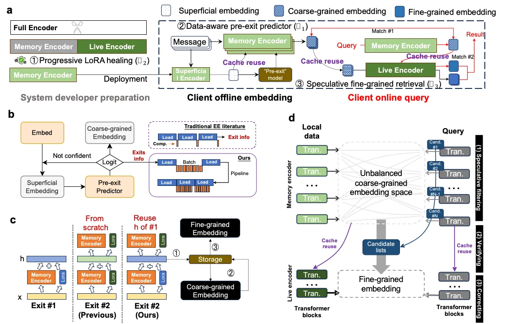
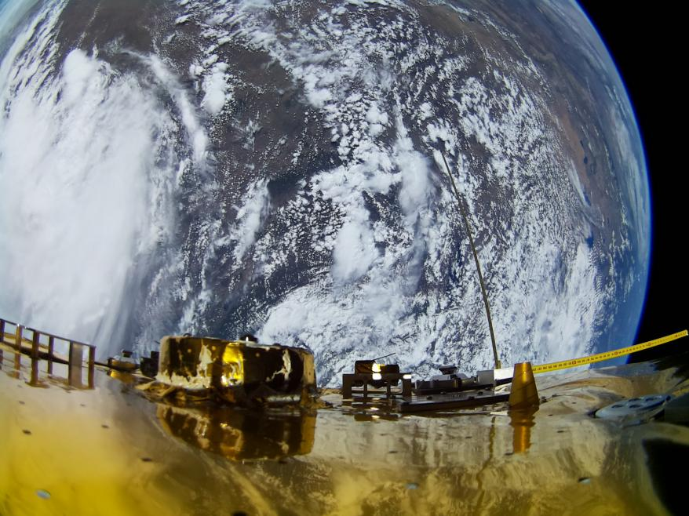
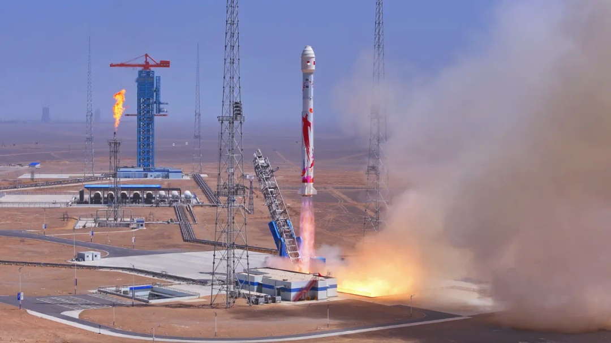
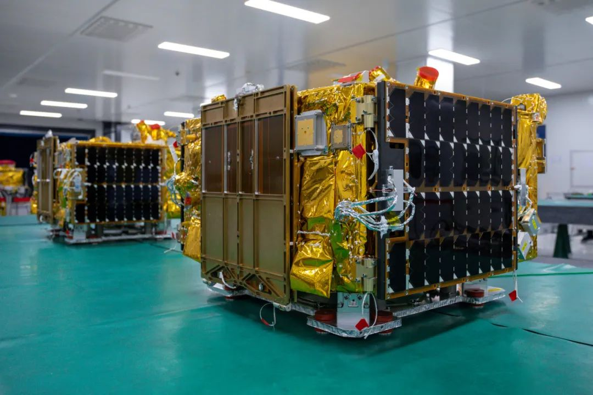
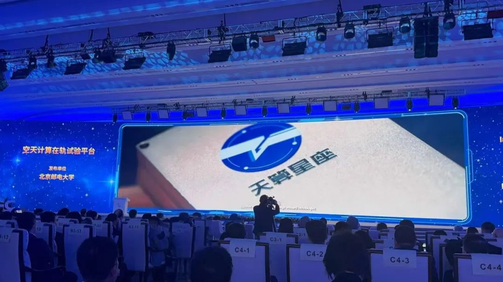



1. **Nature子刊刊发实验室副主任王尚广教授团队突破性成果**
   [✈详情](https://mp.weixin.qq.com/s/QEaKyLf1fRW4gKjUoKq6hA)
   
   6月19日，**Nature子刊《Nature Communications》**正式发表题为"Ubiquitous Memory Augmentation via Mobile Multimodal Embedding System"（**基于端侧多模态大模型系统的普适性记忆增强**）的研究论文。论文第一作者为北京邮电大学博士生**蔡栋琪**，北京邮电大学计算机学院（国家示范性软件学院）**王尚广教授、徐梦炜副教授**与**剑桥大学Nicholas D. Lane教授**共同担任本文通讯作者。
2. 6月20日7点00分随北邮二号/三号卫星平台发射升空的“北邮光谱二号”高光谱载荷和超百Gbps星间激光通信载荷**圆满完成在轨验证任务**，首次以**高光谱遥感数据毫秒采集、秒级传输、智能处理**实现了空天地信息“采集-传输-计算”一体化**验证了“采传一体”智能光通信**的可行性
   [✈详情](https://mp.weixin.qq.com/s/w-rMp7y7HJYsMhZt7Bsmcg)
   
3. **北邮二号、三号卫星顺利进入预定轨道！**
   [✈详情](https://mp.weixin.qq.com/s/c4rt98tuC7fmLHPqJwjNag)
   
   北京时间2025年5月17日12时12分，我国在东风商业航天创新试验区使用朱雀二号改进型遥二运载火箭，以“一箭六星”发射方式，成功将“北邮二号”与“北邮三号”卫星发射升空。刚刚回传的卫星遥测数据显示，“北邮二号”与“北邮三号”卫星发射升空后顺利进入预定轨道，遥测参数正常，太阳翼、天线均展开正常。卫星的成功入轨标志着我国空天信息基础设施建设迈出关键一步，并在空天计算、激光通信、智能遥感等关键技术领域实现重要突破，将有力提升我国在 6G 空天信息基础设施等前沿领域的自主创新能力。
   
4. **北京邮电大学王尚广教授团队研制的全球首个“空天计算在轨试验平台——天算星座”在2025中关村论坛年会上作为重大科技成果发布。**
    [✈详情](https://mp.weixin.qq.com/s/CMnz7WenOnD6eJrGs4wyOw)
    
   3月31日下午，由北京邮电大学牵头联合国内优势单位，攻克星地一体服务化管理与资源配置、星间跨域协同与服务供应等多项核心技术，共同建设的全球首个空天计算在轨试验平台——天算星座，在2025年中关村论坛重大成果专场正式发布。
   
5. **12 Jun., 2017**  Dr. Yunxin Liu of Microsoft Research Asia visited my lab  
   *2017年6月12日，微软亚洲研究院研究员刘云新博士来实验室访问*  
   

6. **13 May., 2017**  Prof. Yun Yang of Swinburne University of Technology visited my lab  
   *2017年5月13日，澳大利亚斯威本科技大学终身教授、博导杨耘来实验室访问*  
   

7. **16-20 Nov, 2016**  Prof. MYUNG HO KIM and Prof. KOK-SENG WONG of Soongsil University, South Korea visited my lab  
   *2016年11月16-20日，韩国崇实大学教授 MYUNG HO KIM 与教授 KOK-SENG WONG 来实验室访问*  
   

8. **12 Nov., 2016**  Prof. Stephen S. Yau of Arizona State University visited my lab  
   *2016年11月12日，亚利桑那州立大学教授 Stephen S. Yau 来实验室访问*  
   

9.  **20 April., 2016**  Prof. Rajkumar Buyya of University of Melbourne visited my lab  
   *2016年4月20日，墨尔本大学教授 Rajkumar Buyya 来实验室访问*  
   

10. **11 Mar., 2016**  IEEE Fellow, Huawei CTO Dr. Wu Chou visited my lab  
   *2016年3月11日，华为CTO周芜博士来实验室访问*  
   

11. **22 Jan., 2016**  IEEE Fellow, Prof. Stephen S. Yau of Arizona State University visited my lab  
   *2016年1月22日，亚利桑那州立大学教授 Stephen S. Yau 来实验室访问*  
   

12. **12 Jan., 2016**  Prof. Song Guo of University of Aizu visited my lab  
   *2016年1月12日，日本会津大学的教授 Song Guo 来实验室访问。Prof. Song Guo 讲了云计算环境下的流量感知的分析和预测问题，同时和实验室的博士生进行了交流*

13. **5 Jan., 2016**  IEEE Fellow, Prof. Calton Pu of Georgia Institute of Technology visited my lab  
   *2016年1月5日，佐治亚理工学院计算机学院的 Calton Pu 教授来实验室访问。Calton Pu 教授介绍了佐治亚理工学院的基本情况和最新的研究进展，并就云计算环境下短瓶颈的影响，即延迟长尾问题等热点问题与本小组内的博士及硕士生进行了交流*  
   

14. **4 Dec., 2015**  Dr. Chin-Yew Lin of Microsoft Research Asia visited my lab  
    *2015年12月4日，微软亚洲研究院的高级主管 Chin-Yew Lin 博士来实验室访问。Chin-Yew Lin 博士介绍了微软亚洲研究院的基本情况和最新研究进展，并就机器学习、模式识别等热点研究问题与本小组内的博士及硕士生进行了交流*

15. **16 Nov., 2015**  Dr. Rong Chang of IBM visited my lab  
    *2015年11月16日，美国IBM的 Rong Chang 博士来实验室访问，就工业界与学术界在SLA领域的最新研究成果进行了学术报告，并就SLA问题与本小组内的博士及硕士生进行了讨论*  
    
