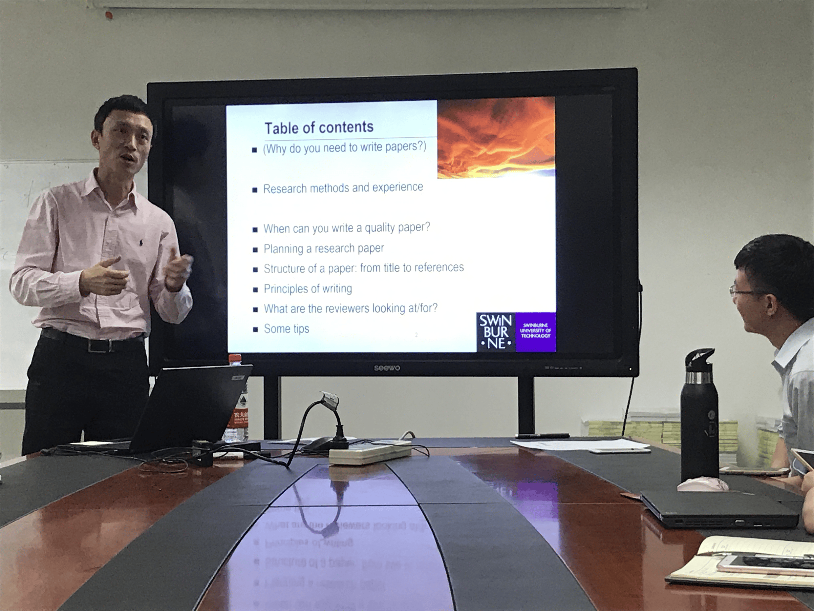
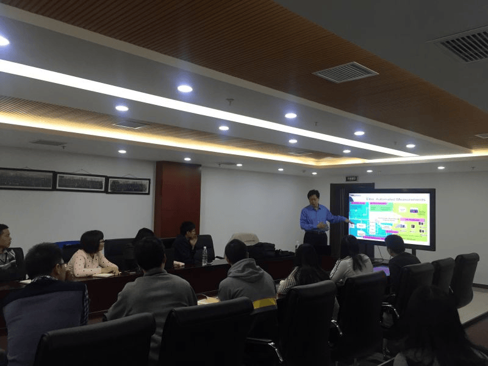



1. **12 Jun., 2017**  Dr. Yunxin Liu of Microsoft Research Asia visited my lab  
   *2017年6月12日，微软亚洲研究院研究员刘云新博士来实验室访问*  
   

2. **13 May., 2017**  Prof. Yun Yang of Swinburne University of Technology visited my lab  
   *2017年5月13日，澳大利亚斯威本科技大学终身教授、博导杨耘来实验室访问*  
   

3. **16-20 Nov, 2016**  Prof. MYUNG HO KIM and Prof. KOK-SENG WONG of Soongsil University, South Korea visited my lab  
   *2016年11月16-20日，韩国崇实大学教授 MYUNG HO KIM 与教授 KOK-SENG WONG 来实验室访问*  
   

4. **12 Nov., 2016**  Prof. Stephen S. Yau of Arizona State University visited my lab  
   *2016年11月12日，亚利桑那州立大学教授 Stephen S. Yau 来实验室访问*  
   

5. **20 April., 2016**  Prof. Rajkumar Buyya of University of Melbourne visited my lab  
   *2016年4月20日，墨尔本大学教授 Rajkumar Buyya 来实验室访问*  
   

6. **11 Mar., 2016**  IEEE Fellow, Huawei CTO Dr. Wu Chou visited my lab  
   *2016年3月11日，华为CTO周芜博士来实验室访问*  
   

7. **22 Jan., 2016**  IEEE Fellow, Prof. Stephen S. Yau of Arizona State University visited my lab  
   *2016年1月22日，亚利桑那州立大学教授 Stephen S. Yau 来实验室访问*  
   

8. **12 Jan., 2016**  Prof. Song Guo of University of Aizu visited my lab  
   *2016年1月12日，日本会津大学的教授 Song Guo 来实验室访问。Prof. Song Guo 讲了云计算环境下的流量感知的分析和预测问题，同时和实验室的博士生进行了交流*

9. **5 Jan., 2016**  IEEE Fellow, Prof. Calton Pu of Georgia Institute of Technology visited my lab  
   *2016年1月5日，佐治亚理工学院计算机学院的 Calton Pu 教授来实验室访问。Calton Pu 教授介绍了佐治亚理工学院的基本情况和最新的研究进展，并就云计算环境下短瓶颈的影响，即延迟长尾问题等热点问题与本小组内的博士及硕士生进行了交流*  
   

10. **4 Dec., 2015**  Dr. Chin-Yew Lin of Microsoft Research Asia visited my lab  
    *2015年12月4日，微软亚洲研究院的高级主管 Chin-Yew Lin 博士来实验室访问。Chin-Yew Lin 博士介绍了微软亚洲研究院的基本情况和最新研究进展，并就机器学习、模式识别等热点研究问题与本小组内的博士及硕士生进行了交流*

11. **16 Nov., 2015**  Dr. Rong Chang of IBM visited my lab  
    *2015年11月16日，美国IBM的 Rong Chang 博士来实验室访问，就工业界与学术界在SLA领域的最新研究成果进行了学术报告，并就SLA问题与本小组内的博士及硕士生进行了讨论*  
    
