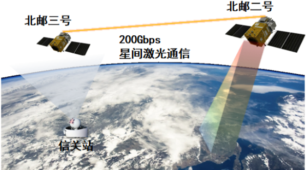



1. **6月20日7点00分随北邮二号/三号卫星平台发射升空的“北邮光谱二号”高光谱载荷和超百Gbps星间激光通信载荷圆满完成在轨验证任务首次以高光谱遥感数据毫秒采集、秒级传输、智能处理实现了空天地信息“采集-传输-计算”一体化验证了“采传一体”智能光通信的可行性**
   
   “北邮光谱二号”高光谱载荷，构建了“采传一体”系统的高分多维信息感知核心。相比“北邮光谱一号”，“北邮光谱二号”载荷空间分辨率提升一倍，创新性采用光场压缩编码、双路耦合架构与像素智能融合等先进技术，具备**超过45波段**高光谱探测能力，支持**每秒超30帧的视频级**高光谱成像。针对推扫式成像时效滞后与数据积压问题，该载荷通过毫秒快照直接获取高压缩的完整光谱空间数据，为“采传一体”提供超**高速、高压缩**的数据采集，从源头保障灾害响应的实时性。同时该载荷增强了空间数据采集能力与精确解译水平，克服了计算遥感影像在成像清晰度与信息提取方面的局限，助力提升了我国卫星互联网**对地感知和实时监测能力**，为灾害响应、精准农业、环境监测等领域提供技术支撑。
   
   **此次验证展现了北邮在空天信息技术领域的领先实力，其创新的智能处理范式为空天信息网络建设提供了自主可控的技术体系，有力支撑了我国空天信息产业的发展。**
2. **成功发射"北邮二号""北邮三号"卫星 天算星座二期正式启动**
   
   北京时间2025年5月17日12时12分，我国在东风商业航天创新试验区使用朱雀二号改进型遥二运载火箭，**以“一箭六星”发射方式，成功将“北邮二号”与“北邮三号”卫星发射升空。刚刚回传的卫星遥测数据显示，“北邮二号”与“北邮三号”卫星发射升空后顺利进入预定轨道，遥测参数正常，太阳翼、天线均展开正常。**
   
   **卫星的成功入轨标志着我国空天信息基础设施建设迈出关键一步**，并在空天计算、激光通信、智能遥感等**关键技术领域实现重要突破，将有力提升我国在 6G 空天信息基础设施等前沿领域的自主创新能力**。
   
   **作为我国算力星座的首创者，此次发射，也标志着天算计划中的天算星座二期正式启动，天算星座二期共计发射24颗卫星，将重点围绕空天计算、6G网络、智能遥感等多个前沿领域开展创新研究**，为我国开展6G空天信息基础设施和太空云计算基础设施建设提供了坚实支撑。
   
3. **北京邮电大学王尚广教授团队研制的全球首个“空天计算在轨试验平台——天算星座”在2025中关村论坛年会上作为重大科技成果发布。**
   
   天算星座以 “新规律的发现者、新技术的开拓者、新设备的研发者”为科学价值，以“代码公开、数据开放、系统开源”为建设理念，以**将卫星打造成“带翅膀的计算机”**为科研梦想，以为我国在空天计算领域的大国竞争提供关键技术支撑为最终追求，形成了“天上有星、地上有站、中间有智算”的空天计算在轨试验开放开源平台。该平台通过将天算星座的网络、通信、计算、存储等能力以服务化的形式进行封装和API接口开放，使得**科研人员能够通过互联网即可实现在轨试验验证**。
   

   该平台运行以来，已产生多项领先技术，例如，轻量化星载5G核心网系统获得IEEE卫星技术创新奖，**试验数据已经公开**；研制的云原生卫星平台将在轨目标识别精度提升50%以上，卫星回传数据量减少90%以上，处于国际领先水平，**代码已提供给国际云原生基金会KubeEdge项目**；具有完全自主知识产权的双内核卫星操作系统RROS搭载TY33卫星成功发射并实现在轨可靠运行，研发经验获得USENIX ATC最佳论文奖，**系统已经开源**；通过创新性技术架构和材料工艺的突破，研发的通用太空服务器将制造成本压缩至现有主流产品的十分之一，为大规模太空基础设施建设提供了经济可行的技术解决方案。
   
4. **12 Jun., 2017**  Dr. Yunxin Liu of Microsoft Research Asia visited my lab  
   *2017年6月12日，微软亚洲研究院研究员刘云新博士来实验室访问*  
   

5. **13 May., 2017**  Prof. Yun Yang of Swinburne University of Technology visited my lab  
   *2017年5月13日，澳大利亚斯威本科技大学终身教授、博导杨耘来实验室访问*  
   

6. **16-20 Nov, 2016**  Prof. MYUNG HO KIM and Prof. KOK-SENG WONG of Soongsil University, South Korea visited my lab  
   *2016年11月16-20日，韩国崇实大学教授 MYUNG HO KIM 与教授 KOK-SENG WONG 来实验室访问*  
   

7. **12 Nov., 2016**  Prof. Stephen S. Yau of Arizona State University visited my lab  
   *2016年11月12日，亚利桑那州立大学教授 Stephen S. Yau 来实验室访问*  
   

8. **20 April., 2016**  Prof. Rajkumar Buyya of University of Melbourne visited my lab  
   *2016年4月20日，墨尔本大学教授 Rajkumar Buyya 来实验室访问*  
   

9.  **11 Mar., 2016**  IEEE Fellow, Huawei CTO Dr. Wu Chou visited my lab  
   *2016年3月11日，华为CTO周芜博士来实验室访问*  
   

10. **22 Jan., 2016**  IEEE Fellow, Prof. Stephen S. Yau of Arizona State University visited my lab  
   *2016年1月22日，亚利桑那州立大学教授 Stephen S. Yau 来实验室访问*  
   

11. **12 Jan., 2016**  Prof. Song Guo of University of Aizu visited my lab  
   *2016年1月12日，日本会津大学的教授 Song Guo 来实验室访问。Prof. Song Guo 讲了云计算环境下的流量感知的分析和预测问题，同时和实验室的博士生进行了交流*

12. **5 Jan., 2016**  IEEE Fellow, Prof. Calton Pu of Georgia Institute of Technology visited my lab  
   *2016年1月5日，佐治亚理工学院计算机学院的 Calton Pu 教授来实验室访问。Calton Pu 教授介绍了佐治亚理工学院的基本情况和最新的研究进展，并就云计算环境下短瓶颈的影响，即延迟长尾问题等热点问题与本小组内的博士及硕士生进行了交流*  
   

13. **4 Dec., 2015**  Dr. Chin-Yew Lin of Microsoft Research Asia visited my lab  
    *2015年12月4日，微软亚洲研究院的高级主管 Chin-Yew Lin 博士来实验室访问。Chin-Yew Lin 博士介绍了微软亚洲研究院的基本情况和最新研究进展，并就机器学习、模式识别等热点研究问题与本小组内的博士及硕士生进行了交流*

14. **16 Nov., 2015**  Dr. Rong Chang of IBM visited my lab  
    *2015年11月16日，美国IBM的 Rong Chang 博士来实验室访问，就工业界与学术界在SLA领域的最新研究成果进行了学术报告，并就SLA问题与本小组内的博士及硕士生进行了讨论*  
    
